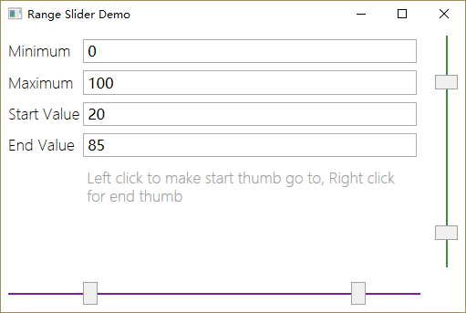

# WpfRangeSlider
WPF Range Slider - from [GitHub](https://github.com/funwaywang/WpfRangeSlider)  
Downloaded 9 Jul 2025;&nbsp; built with VS Community 2022
- changed to .NET 4.8
- `RangeSlider\RangeSlider.sln` builds a demo app

---

A WPF Control, with two Thumb to adjust show range,
there are 4 main dependency properties:

* **Maximum** - the max value can be
* **Minimum** - the min value can be
* **Start** - the start value (left thumb) of current range
* **End** - the end value (right thumb) of current range

Looks like this:

If you want use it into your project, Just import two files below:
* [RangeSlider.cs](https://github.com/funwaywang/WpfRangeSlider/blob/master/RangeSlider/RangeSlider/RangeSlider.cs)
* [Themes/RangeSlider.xaml](https://github.com/funwaywang/WpfRangeSlider/blob/master/RangeSlider/RangeSlider/Themes/RangeSlider.xaml)
